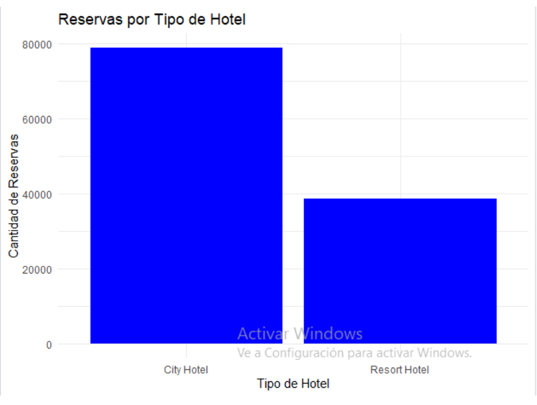
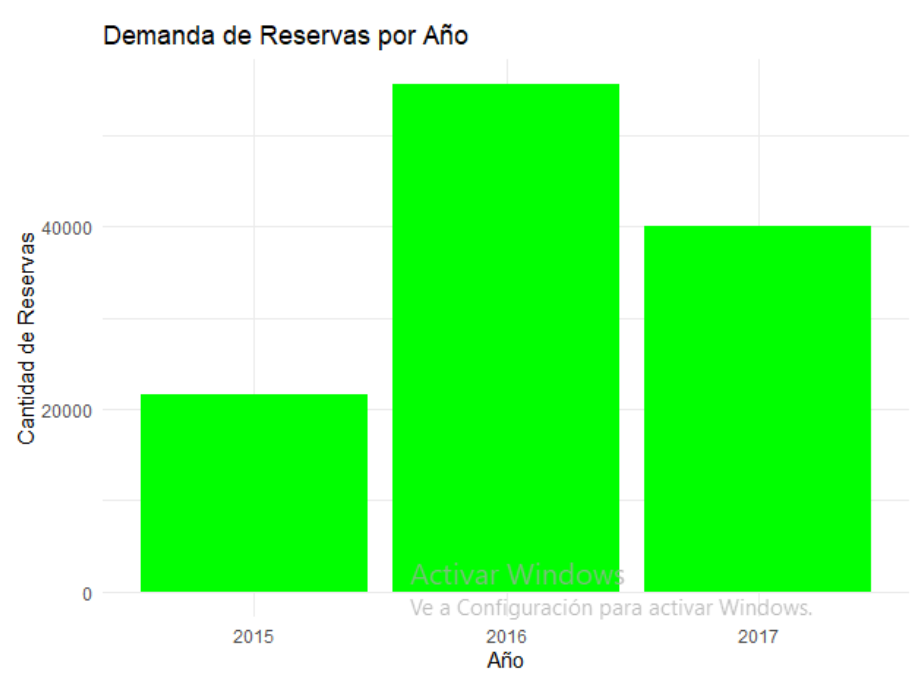
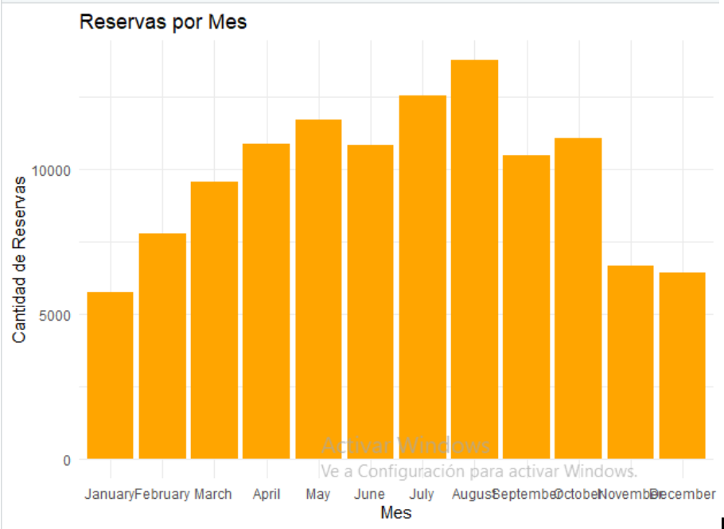
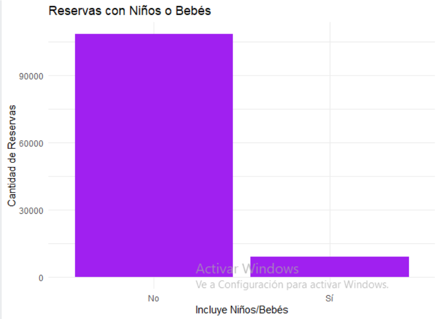
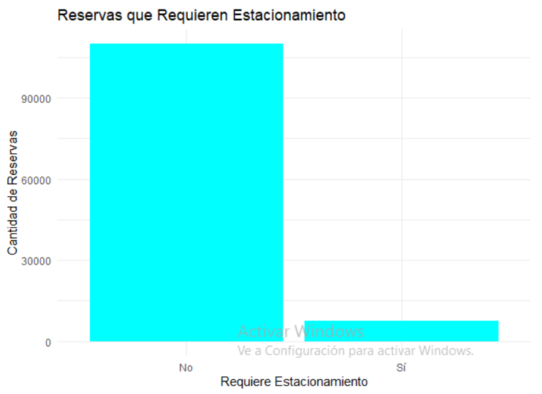
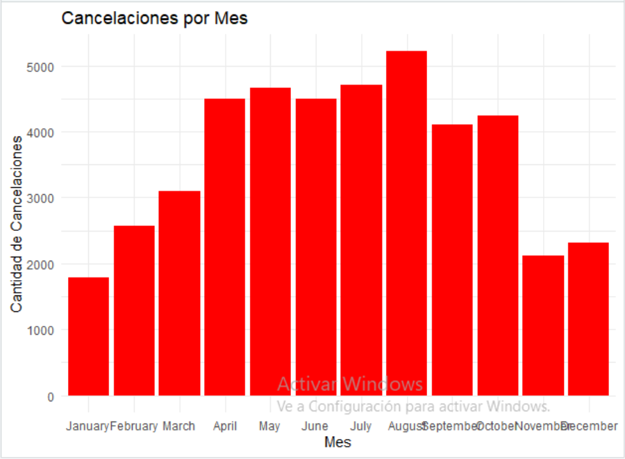

# HOTEL BOOKING
## Proyecto de Ciencia de Datos

### Grupo: 1

### Integrantes
- Marcelo Paolo Murguía Lozano       (u202013543)                                            
- Renee Enriquez Montalvan           (U202221447)                                                 
- Wendy Carol Hernández Pérez        (U202422529)

### Índice

1. [Objetivo](#objetivo)  
2. [Casos de Análisis](#casos-de-análisis)  
   2.1. [Origen de los datos](#origen-de-los-datos)  
   2.2. [Casos de Uso Aplicables](#casos-de-uso-aplicables)  
3. [Data Set](#data-set)  
   3.1. [Descripción del Data Set](#descripción-del-data-set)  
   3.2. [Variables](#variables)   
4. [Visualización de Datos](#visualizacion-de-datos)
5. [Conclusión](#conclusión)
6. [Referencias](#referencias)


## 1. Objetivo
El objetivo del presente informe es proporcionar información veraz y confiable, reduciendo la cantidad de datos atípicos presentes 
en el dataset. Esto permitirá su uso adecuado para realizar análisis y estudios analíticos, facilitando la identificación 
de patrones en el perfil de los huéspedes, los servicios más utilizados, entre otros aspectos clave. De esta manera, se podrá tomar 
decisiones estratégicas para mejorar el servicio del hotel o anticiparse a futuros eventos, optimizando la experiencia del cliente 
y la eficiencia operativa.

## 2. Casos de Análisis
### 2.1. Origen de los datos
El conjunto de datos titulado "Hotel Booking Demand Datasets" fue publicado en 2019 por la revista International Journal of Hospitality 
Management. Los autores del artículo, Nuno Antonio, Ana de Almeida y Luis Nunes, reconocidos expertos en el campo de la gestión hotelera,
realizaron una investigación exhaustiva sobre la demanda de reservas en hoteles. La recopilación de los datos comenzó en octubre de 2018
y su publicación tuvo lugar en diciembre del mismo año, abarcando hoteles ubicados en Lisboa, Portugal. Este dataset contiene información
proveniente del Sistema de Gestión de Propiedades (PMS) de los hoteles, cada uno con su propia base de datos SQL, por esto es que podemos
afirmar que la informacion es confiable y de calidad.  
  

### 2.2 Casos de Uso Aplicables
¿Quién podría estar interesado en este análisis?

- Agencias de viajes: Este análisis les permite comprender mejor los comportamientos y preferencias de sus clientes. Con estos datos,
pueden desarrollar estrategias personalizadas, mejorar la experiencia del cliente y aumentar la lealtad.

- Propietarios de hoteles: Les ayuda a optimizar sus estrategias de reservas y ajustar los precios para maximizar ingresos. Además, pueden
tomar decisiones informadas sobre la gestión de servicios.

- Departamentos de marketing: Pueden utilizar los insights del análisis de reservas para segmentar mejor el mercado y crear estrategias de
marketing personalizadas, atrayendo nuevos clientes y mejorando la participación del cliente.

- Investigadores: Les permite desarrollar teorías y modelos sobre el comportamiento del cliente y la industria hotelera, además de crear 
modelos predictivos que anticipen la demanda de habitaciones en diferentes momentos y lugares.

¿Qué problemas o necesidades responde este análisis?

- Mejorar la predicción de la demanda: El análisis permite anticipar la demanda futura, ayudando a los hoteles a planificar mejor sus recursos 
y estrategias.

- Aumentar la lealtad de clientes: Al analizar las preferencias de reserva, los hoteles pueden ofrecer servicios personalizados y desarrollar 
programas de recompensas que aumenten la fidelidad del cliente.

- Optimizar ingresos: El análisis de reservas y cancelaciones ayuda a los hoteles a ajustar sus precios y disponibilidad de habitaciones en
función de la demanda, evitando sobreventas o subventas.

- Identificar oportunidades de innovación: Los datos ofrecen valiosos insights para diferenciarse de la competencia, implementando tecnologías
innovadoras que mejoren la experiencia del cliente.


## 3. DataSet

### 3.1 Descripción del Data Set
El dataset contiene informacion de los registros de hoteles entre los años 2015 y 2017, informacion que puede visualizar descargando el dataset
en la carpeta data. 
Para ejecutar el script ubicado en la carpeta "code", debe seleccionar una carpeta donde ubicar el dataset y luego cargar usando 
```
setwd("ubicacion de la carpeta con el dataset")
hotel_data <-read.csv('hotel_bookings.csv', header=TRUE, sep=',',dec='.',stringsAsFactors = FALSE,,na.strings="")

View(hotel_data)
names(hotel_data)
str(hotel_data)
summary(hotel_data)
```
Si no puede usar el comando ` View(hotel_data) ` y otros, entonces instale las librerias necesarias como ` tidyverse `, ` ggplot2 `
   
### 3.2 Variables
- BO: Booking
- BL: Booking change log
- TR: Transactions
- NT: Nationalities
- DC: Distribution channels
- MS: Market segments
- ML: Meals

| **Variable**                     | **Tipo**       | **Descripción**                                                                                                                                                                                                               | **Fuente/Ingeniería**                                                             |
|-----------------------------------|----------------|--------------------------------------------------------------------------------------------------------------------------------------------------------------------------------------------------------------------------------|-----------------------------------------------------------------------------------|
| ADR                               | Numérico       | Tarifa diaria promedio, calculada dividiendo la suma de todas las transacciones de alojamiento por el número total de noches de estancia                                                                                         | BO, BL y TR / Calculado                                                          |
| Adults                            | Entero         | Número de adultos                                                                                                                                                                                                              | BO y BL                                                                          |
| Agent                             | Categórico     | ID de la agencia de viajes que hizo la reserva                                                                                                                                                                                  | BO y BL                                                                          |
| ArrivalDateDayOfMonth             | Entero         | Día del mes de la fecha de llegada                                                                                                                                                                                              | BO y BL                                                                          |
| ArrivalDateMonth                  | Categórico     | Mes de la fecha de llegada con 12 categorías: "Enero" a "Diciembre"                                                                                                                                                             | BO y BL                                                                          |
| ArrivalDateWeekNumber             | Entero         | Número de semana de la fecha de llegada                                                                                                                                                                                         | BO y BL                                                                          |
| ArrivalDateYear                   | Entero         | Año de la fecha de llegada                                                                                                                                                                                                      | BO y BL                                                                          |
| AssignedRoomType                  | Categórico     | Código del tipo de habitación asignada a la reserva. A veces, el tipo de habitación asignado difiere del reservado por razones operativas del hotel (ej. sobreventa) o por solicitud del cliente                                  | BO y BL                                                                          |
| Babies                            | Entero         | Número de bebés                                                                                                                                                                                                                 | BO y BL                                                                          |
| BookingChanges                    | Entero         | Número de cambios realizados en la reserva desde el momento en que se ingresó en el PMS hasta el momento del check-in o cancelación                                                                                             | BO y BL / Calculado                                                             |
| Children                          | Entero         | Número de niños, incluye tanto niños pagables como no pagables                                                                                                                                                                  | BO y BL                                                                          |
| Company                           | Categórico     | ID de la empresa/entidad que hizo la reserva o responsable del pago. El ID se presenta en lugar de la designación por razones de anonimato                                                                                        | BO y BL                                                                          |
| Country                           | Categórico     | País de origen. Las categorías están representadas en formato ISO 3155-3:2013                                                                                                                                                   | BO, BL y NT                                                                      |
| CustomerType                      | Categórico     | Tipo de reserva, con cuatro categorías: Contrato, Grupo, Transitorio, Transitorio con otros                                                                                                                                      | BO y BL                                                                          |
| DaysInWaitingList                 | Entero         | Número de días que la reserva estuvo en lista de espera antes de ser confirmada                                                                                                                                                 | BO / Calculado                                                                  |
| DepositType                       | Categórico     | Indicación de si el cliente hizo un depósito para garantizar la reserva. Tres categorías: Sin Depósito, No Reembolsable, Reembolsable                                                                                             | BO y TR / Calculado                                                             |
| DistributionChannel               | Categórico     | Canal de distribución de la reserva. "TA" significa "Agentes de viajes", "TO" significa "Operadores turísticos"                                                                                                                  | BO, BL y DC                                                                     |
| IsCanceled                        | Categórico     | Indica si la reserva fue cancelada (1) o no (0)                                                                                                                                                                                 | BO                                                                               |
| IsRepeatedGuest                   | Categórico     | Indica si el cliente ha sido un huésped repetido (1) o no (0)                                                                                                                                                                   | BO, BL y C / Variable creada                                                    |
| LeadTime                          | Entero         | Número de días entre la fecha en que se ingresó la reserva en el PMS y la fecha de llegada                                                                                                                                      | BO y BL / Calculado                                                             |
| MarketSegment                     | Categórico     | Segmento de mercado de la reserva. "TA" significa "Agentes de viajes", "TO" significa "Operadores turísticos"                                                                                                                    | BO, BL y MS                                                                     |
| Meal                              | Categórico     | Tipo de comida reservada. Las categorías son: SC (sin comida), BB (desayuno), HB (media pensión), FB (pensión completa)                                                                                                           | BO, BL y ML                                                                     |
| PreviousBookingsNotCanceled       | Entero         | Número de reservas anteriores no canceladas por el cliente antes de la reserva actual                                                                                                                                           | BO y BL / Calculado                                                             |
| PreviousCancellations             | Entero         | Número de reservas anteriores canceladas por el cliente antes de la reserva actual                                                                                                                                               | BO y BL / Calculado                                                             |
| RequiredCardParkingSpaces         | Entero         | Número de espacios de estacionamiento requeridos por el cliente                                                                                                                                                                 | BO y BL                                                                          |
| ReservationStatus                 | Categórico     | Último estado de la reserva: Cancelada, Check-Out, No-Show                                                                                                                                                                     | BO                                                                               |
| ReservationStatusDate             | Fecha          | Fecha en que se estableció el último estado de la reserva. Puede usarse junto con el estado de la reserva para entender cuándo se canceló la reserva o cuándo se realizó el check-out del cliente                                | BO                                                                               |

## 4. Visualización de Datos

### ¿Cuántas reservas se realizan por tipo de hotel? ¿Qué tipo de hotel prefiere la gente?
Se hicieron 78672 reservas de hotel en la ciudad y 38504 reservas de hotel en el de tipo resort.  


### ¿Está aumentando la demanda con el tiempo?
Se hicieron 21629 reservas en 2015, 55506 reservas en 2016 y 40041 reservas en 2017.  


### ¿Cuáles son las temporadas de reservas (alta, media, baja)?
La cantidad de registros según el mes son:
- Agosto: 13,733
- Julio: 12,509
- Mayo: 11,676
- Octubre: 11,046
- Abril: 10,864
- Junio: 10,830
- Septiembre: 10,460
- Marzo: 9,526
- Febrero: 7,748
- Noviembre: 6,653
- Diciembre: 6,400
- Enero: 5,731  


### ¿Cuántas reservas incluyen niños y/o bebés?
Como se puede observar, la mayoría de reservas no cuentan con niños y bebés. Siendo un total de 108163 reservas y a diferencia de los que sí cuentan con un total de 9013 reservas.  


### ¿Es importante contar con espacios de estacionamiento?
Se obtuvieron un total de 109829 registros en los que los clientes no necesitan espacios de estacionamientos a diferencia de los 7347 registros que sí lo necesitaron.  


### ¿En qué meses del año se producen más cancelaciones de reservas?
Según podemos observar un gran número de las cancelaciones son en el mes de agosto seguido de julio y mayo, probablemente debido al hecho de ser el verano o su proximidad a este.  



## 5. Conclusiones
De acuerdo con el análisis realizado en este informe, podemos concluir que la demanda de servicios hoteleros en la región de Lisboa, Portugal, experimentó un crecimiento superior al 100%, seguido de una disminución en 2017, lo que resultó en una caída en las ganancias y un bajo rendimiento de las inversiones en ese año. Aunque no es posible determinar con exactitud las causas de la baja demanda con los datos disponibles, se puede inferir que está relacionada con las tendencias y preferencias de las personas solteras, quienes constituyen el principal grupo de clientes en los resorts de la región. Además, algunos factores como la calidad del servicio también pueden estar influyendo en la demanda. Por tanto, se sugiere que los hoteles enfoquen sus servicios hacia este segmento de solteros, que representa el mayor porcentaje de clientes en la zona.


## 6. Referencias
[1] Nuno, A. (2018). Hotel booking demand datasets. Artículo en línea. https://www.sciencedirect.com/science/article/pii/S2352340918315191 Accedido en 12 de Enero de 2018.

